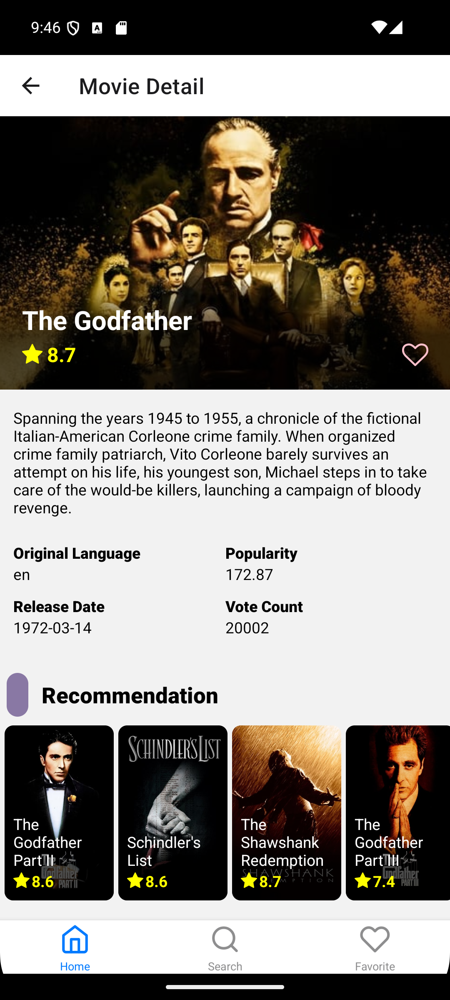

# Movie App

Movie App is an application created to fulfill the final assignment of the Progate Mobile App Development with React Native training held by Digitalent.

This application allows users to see information about films currently showing in cinemas, trending, etc. Users can also save a list of their favorite movies.

# Members: Kelompok I - Class G

| Registration Number | Name                        | Email                         | Status     |
| ------------------- | --------------------------- | ----------------------------- | ---------- |
| 1957887840-840      | Muhammad Fikri Ahsan Mujhar | fikriaksan17@gmail.com        | Active     |
| 1957887840-853      | Arman Fadhilla              | armanfadilah20@gmail.com      | Active     |
| 1957887840-864      | Hayatun Nisa                | nisahayatun03022002@gmail.com | Active     |
| 1957887840-861      | ~~Evan Grenald G. P. N.~~   | evangrenald@gmail.com         | Non Active |
| 1957887840-860      | ~~Ariq Juliandry Maulana~~  | ariqjuliandrym@gmail.com      | Non Active |

# Features

| Feature            | Created By                  |
| ------------------ | --------------------------- |
| Home Screen        | Muhammad Fikri Ahsan Mujhar |
| Search By Keyword  | Arman Fadhilla              |
| Search By Category | Muhammad Fikri Ahsan Mujhar |
| Favorite Movies    | Hayatun Nisa                |

**Home Screen**

Displays a list of films currently showing in cinemas, films that will be shown, films with top ratings, and films that are currently popular.

  
  
  

**Search By Keyword**

Allows users to search for films based on keywords in the title or overview of the film.

  
  

**Search By Category**

Allows users to view a list of films based on their genre or category.

  
  
  

**Favorite Movies**

View a list of the user's favorite movies.

  
  
  

